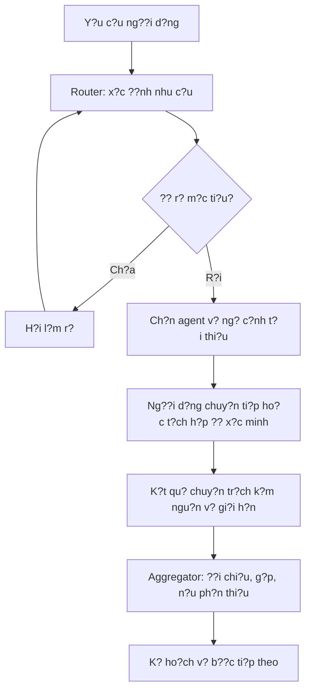

# S? ?? ?i?u ph?i

```mermaid
flowchart TD
 U[Y?u c?u ng??i d?ng] --> R[Router: x?c ??nh nhu c?u]
 R --> C{?? r? m?c ti?u?}
 C -->|Ch?a| Q[H?i l?m r?]
 Q --> R
 C -->|R?i| P[Ch?n agent v? ng? c?nh t?i thi?u]
 P --> S[Ng??i d?ng chuy?n ti?p ho?c t?ch h?p ?? x?c minh]
 S --> O[K?t qu? chuy?n tr?ch k?m ngu?n v? gi?i h?n]
 O --> A[Aggregator: ??i chi?u, g?p, n?u ph?n thi?u]
 A --> N[K? ho?ch v? b??c ti?p theo]
```

S? ?? m? t? quy tr?nh d? ki?n, kh?ng ch?ng minh runtime g?i agent ?? t?n t?i.
